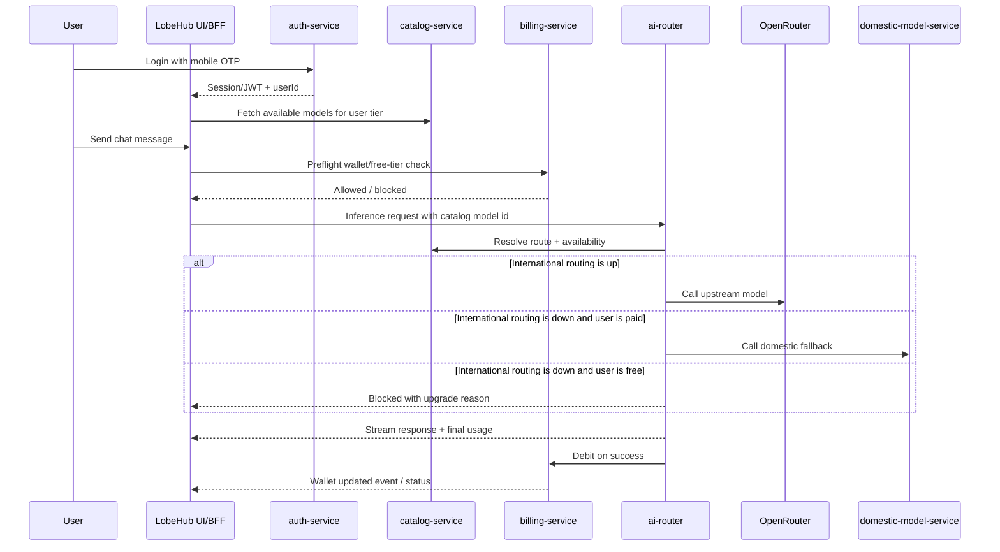

# QuickChat as a Separate Project: LobeHub Sync and Integration Plan

## 1. Objective

QuickChat should be treated as a separate product/project that uses LobeHub as the AI workspace shell, not as a direct rewrite of LobeHub's internal business model.

The QuickChat-specific parts should live in separate services and shared contracts:

- SMS/mobile OTP authentication
- Pay-as-you-go wallet and credit ledger
- ZarinPal payments
- Model catalog and pricing
- Managed OpenRouter routing
- Domestic fallback routing
- Persian STT
- Telegram adapter
- CMS and admin/ops

LobeHub should keep owning:

- Chat UI and streaming shell
- Agents and tools UX
- Model picker UI shell
- Files and attachments UI
- Image/video workspace UI
- Settings shell
- Memory/persona UX
- Desktop and popup shells

The integration goal is to avoid a large permanent fork of LobeHub. QuickChat should connect through adapters, business hooks, shared contracts, and service clients.

---

## 2. Current LobeHub Extension Seams

The repository already contains a business extension layer. This is the safest place to connect QuickChat without drifting from upstream LobeHub.

| Area | Existing seam |
|---|---|
| Business feature flag | `packages/business/const/src/index.ts` |
| Business server hooks | `src/business/server/**` |
| Business client hooks | `src/business/client/**` |
| Managed provider mapping | `packages/business/model-runtime/src/**` |
| Billing/top-up placeholders | `src/business/server/lambda-routers/{topUp,spend,subscription}.ts` |
| Runtime billing hook | `src/business/server/model-runtime.ts` |
| Image/video charge hooks | `src/business/server/{image-generation,video-generation}/charge*.ts` |
| Settings business pages | `src/business/client/BusinessSettingPages/**` |
| Business routes | `src/business/client/{BusinessDesktopRoutes,BusinessMobileRoutes}.tsx` |

These files are currently mostly stubs in the open repository. For QuickChat, these stubs become the adapter layer to external services.

---

## 3. Recommended Project Structure

Recommended separation:

```text
quickchat-platform/
  services/
    auth-service/
    billing-service/
    payment-service/
    catalog-service/
    ai-router/
    domestic-model-service/
    media-job-service/
    stt-service/
    telegram-adapter/
    cms-service/
    admin-api/

  packages/
    contracts/
    catalog-client/
    billing-client/
    inference-client/
    auth-client/

lobehub/
  src/business/**              # QuickChat adapter hooks
  packages/business/**         # QuickChat provider/runtime mapping
  docs/quickchat-*.md          # Product integration docs
```

LobeHub should depend only on QuickChat shared clients/contracts, not on service implementation details.

---

## 4. Sync Principles

### 4.1 Do not fork LobeHub core unless unavoidable

Avoid permanent changes in:

```text
src/store/chat/**
src/features/Conversation/**
src/server/modules/ModelRuntime/**
packages/model-runtime/**
packages/model-bank/**
packages/agent-runtime/**
src/libs/trpc/**
src/spa/router/**
```

Use adapters and existing business seams instead.

### 4.2 QuickChat services own product truth

| Product truth | Owning QuickChat service |
|---|---|
| User phone OTP and auth risk | `auth-service` |
| Wallet balance, FIFO batches, ledger | `billing-service` |
| ZarinPal payment status | `payment-service` |
| Model availability, free whitelist, Toman cost | `catalog-service` |
| Provider route, OpenRouter, fallback, settlement | `ai-router` |
| Domestic model capacity | `domestic-model-service` |
| Media job queue/status | `media-job-service` |
| Telegram protocol and account linking | `telegram-adapter` |
| Public content | `cms-service` |
| Operators and audit | `admin-api` |

LobeHub should render UI and call these services; it should not duplicate their business rules.

### 4.3 Keep DTO compatibility inside LobeHub

Adapters should map QuickChat API responses to existing LobeHub view models where possible.

Examples:

- QuickChat catalog model -> LobeHub `ChatModelCard` / `AiProviderModelListItem`
- QuickChat inference stream -> LobeHub SSE stream chunks
- QuickChat wallet transaction -> LobeHub settings/wallet view model
- QuickChat Telegram topic -> LobeHub topic/message view model

---

## 5. Module Impact and Sync Plan

### 5.1 Auth / OTP

#### LobeHub touchpoints

| Path | Current role |
|---|---|
| `src/libs/better-auth/define-config.ts` | Email/password, email OTP, SSO, passkeys |
| `src/app/(backend)/api/auth/[...all]/route.ts` | Better Auth HTTP handler |
| `src/app/[variants]/(auth)/signin/**` | Email-centric sign-in pages |
| `src/app/[variants]/(auth)/signup/**` | Email-centric sign-up pages |
| `src/app/[variants]/(auth)/reset-password/**` | Email reset flow |
| `src/business/client/BusinessAuthProvider.tsx` | Business auth extension point |
| `src/business/client/hooks/useBusinessSignin.ts` | Business sign-in hook |
| `src/business/client/hooks/useBusinessSignup.tsx` | Business sign-up hook |
| `src/business/server/better-auth.ts` | Business auth server seam |
| `packages/database/src/schemas/user.ts` | `phone` and `phoneNumberVerified` fields exist |

#### Impact

QuickChat needs mobile OTP, mobile password login, resend timer, SMS provider health, and anti-abuse. LobeHub only has email OTP/password in this repo.

#### Sync strategy

- `auth-service` owns SMS OTP and phone verification.
- LobeHub keeps Better Auth as a local session bridge, or validates auth-service JWTs in server middleware.
- Implement QuickChat phone UI in `BusinessAuthProvider` and business auth hooks.
- On successful OTP verification, auth-service triggers LobeHub user bootstrap/upsert.

#### Do not fork

- Do not rewrite all auth pages.
- Use the existing business hooks and only replace the auth method UI/flow.

---

### 5.2 Billing / Wallet / Credits

#### LobeHub touchpoints

| Path | Current role |
|---|---|
| `src/business/server/lambda-routers/topUp.ts` | Empty top-up router |
| `src/business/server/lambda-routers/spend.ts` | Empty spend router |
| `src/business/server/lambda-routers/subscription.ts` | Empty subscription router |
| `src/business/server/model-runtime.ts` | Runtime billing hook stub |
| `src/business/server/image-generation/chargeBeforeGenerate.ts` | Image preflight charge stub |
| `src/business/server/image-generation/chargeAfterGenerate.ts` | Image post-charge stub |
| `src/business/server/video-generation/chargeBeforeGenerate.ts` | Video preflight charge stub |
| `src/business/server/video-generation/chargeAfterGenerate.ts` | Video post-charge stub |
| `src/routes/(main)/settings/features/componentMap.ts` | Business settings page registry |
| `src/business/client/BusinessSettingPages/**` | Billing/credits/plans iframe shells |
| `src/server/services/usage/index.ts` | Local token usage stats, not wallet ledger |

#### Impact

Wallet extraction is critical. LobeHub has route names and hooks, but not the actual ledger, pack lifecycle, FIFO expiry, daily free credits, refund logic, or ZarinPal payment state.

#### Sync strategy

- `billing-service` owns the wallet, credit batches, ledger, free daily grants, refunds, and transaction history.
- LobeHub `topUpRouter`, `spendRouter`, and `subscriptionRouter` become thin proxies to billing-service.
- `getBusinessModelRuntimeHooks` calls billing/inference preflight and settlement.
- Image/video charge hooks call billing-service or media-job-service.
- Wallet UI replaces iframe pages under `src/business/client/BusinessSettingPages/**`.

#### Do not fork

- Do not make LobeHub local DB the wallet source of truth.
- Do not reuse LobeHub's local `computeChatCost` as authoritative billing logic.

---

### 5.3 ZarinPal Payments

#### LobeHub touchpoints

| Path | Current role |
|---|---|
| `src/locales/default/subscription.ts` | ZarinPal strings only |
| `locales/*/subscription.json` | ZarinPal translations only |
| `src/business/server/lambda-routers/topUp.ts` | Natural payment initiation proxy |
| `src/business/client/BusinessSettingPages/**` | Current cloud subscription iframe UI |

#### Impact

ZarinPal is not implemented in the repo. Payment-service must be new.

#### Sync strategy

- `payment-service` owns ZarinPal create, callback, verify, idempotency, VAT, and refunds.
- LobeHub calls `topUp.createPayment` and receives a redirect URL.
- Payment callback should hit payment-service, not LobeHub core.
- Billing-service receives verified payment events and grants credit batches.

#### Do not fork

- Do not add ZarinPal SDK into core LobeHub.
- Keep payment provider logic isolated in payment-service.

---

### 5.4 Catalog / OpenRouter / Managed Models

#### LobeHub touchpoints

| Path | Current role |
|---|---|
| `packages/model-bank/**` | Static provider/model catalog |
| `packages/model-bank/src/aiModels/openrouter.ts` | Curated OpenRouter model list |
| `packages/model-runtime/src/providers/openrouter/index.ts` | OpenRouter runtime/provider adapter |
| `src/server/routers/lambda/aiModel.ts` | Model CRUD |
| `src/server/routers/lambda/aiProvider.ts` | Provider CRUD |
| `packages/database/src/schemas/aiInfra.ts` | `ai_models` and `ai_providers` |
| `packages/database/src/repositories/aiInfra/index.ts` | Merges builtin, DB, remote model lists |
| `src/store/aiInfra/**` | Client provider/model state |
| `src/features/ModelSwitchPanel/**` | Model picker UI |
| `src/routes/(main)/settings/provider/**` | Provider settings |
| `src/app/(backend)/webapi/models/[provider]/route.ts` | Remote model list endpoint |

#### Impact

QuickChat's OpenRouter structure is different from LobeHub's. LobeHub OpenRouter is a provider adapter/BYOK-style integration. QuickChat needs a managed OpenRouter gateway:

- Platform holds OpenRouter key.
- User does not bring API key.
- Catalog-service controls free/paid visibility.
- ai-router maps QuickChat model IDs to OpenRouter upstream IDs.
- Cost is displayed in credits and Toman.

#### Sync strategy

- Keep `openrouter` provider code unchanged for generic LobeHub usage.
- Add a QuickChat managed provider slot, for example `quickchat` or a branded replacement for `lobehub`.
- `catalog-service` becomes the source of truth.
- LobeHub consumes catalog snapshots through a `CatalogAdapter`.
- `ModelSwitchPanel` displays QuickChat availability, tier, credits, and Toman estimates from catalog data.
- Hide or disable user OpenRouter BYOK settings in QuickChat builds unless explicitly needed for self-host/dev.

#### Do not fork

- Do not edit `packages/model-runtime/src/providers/openrouter/index.ts` to contain QuickChat billing/routing logic.
- Do not duplicate OpenRouter pricing rules in `model-bank`.

---

### 5.5 AI Router / Inference Facade / Domestic Fallback

#### LobeHub touchpoints

| Path | Current role |
|---|---|
| `src/app/(backend)/webapi/chat/[provider]/route.ts` | Main chat backend entry |
| `src/services/chat/index.ts` | Client chat streaming service |
| `src/store/chat/agents/createAgentExecutors.ts` | Agent executor LLM calls |
| `src/store/chat/slices/aiChat/actions/streamingExecutor.ts` | Streaming orchestration |
| `src/server/modules/ModelRuntime/index.ts` | Runtime initialization from DB/key vault |
| `packages/model-runtime/src/core/ModelRuntime.ts` | Runtime hooks: `beforeChat`, `onChatFinal`, `onChatError` |
| `packages/model-runtime/src/core/RouterRuntime/createRuntime.ts` | Generic fallback router |
| `packages/business/model-runtime/src/router-runtime-options.ts` | Managed router options, currently empty |
| `packages/business/model-runtime/src/model-mapping.ts` | Business model mapping, currently passthrough |
| `packages/openapi/src/services/chat.service.ts` | REST/OpenAPI chat path |
| `src/server/services/agentRuntime/**` | Server-side agent execution |
| `src/server/services/bot/**` | Bot/channel execution path |

#### Impact

If QuickChat separates OpenRouter and domestic fallback, all inference entry points must go through one facade. Otherwise, background agents, bots, OpenAPI, image/video, or memory jobs could bypass billing and routing.

#### Sync strategy

- `ai-router` owns provider calls, OpenRouter credentials, health checks, fallback, route attempts, cost calculation, and settlement metadata.
- LobeHub adds a `QuickChatModelRuntime` or `InferenceClient` that emits LobeHub-compatible SSE chunks.
- `getBusinessModelRuntimeHooks` performs preflight and final settlement calls.
- `resolveBusinessModelMapping` calls catalog/router resolve API instead of returning model unchanged.
- Domestic fallback state is exposed through catalog/ai-router status and rendered in chat/model UI.

#### Do not fork

- Do not modify every chat store action.
- Keep `/webapi/chat/[provider]` shape and swap runtime/provider behavior behind it.

---

### 5.6 Conversation Service

#### LobeHub touchpoints

| Path | Current role |
|---|---|
| `packages/database/src/schemas/{topic,message,session,chatGroup}.ts` | Chat persistence schemas |
| `packages/database/src/models/{topic,message,thread,session}.ts` | Chat data access |
| `src/server/routers/lambda/{topic,message,thread,session,aiChat,share}.ts` | Chat tRPC routes |
| `src/server/services/{message,aiChat,aiAgent}/**` | Chat persistence and orchestration |
| `src/store/chat/**` | Optimistic state, topics, messages, streaming |
| `src/services/{topic,message,thread,session,chat}.ts` | Client services |
| `packages/openapi/src/routes/{topics,messages}.route.ts` | REST topic/message APIs |
| `src/server/services/bot/AgentBridgeService.ts` | Bot-to-topic bridge |

#### Impact

This is the most invasive extraction. Conversation is deeply tied to agents, files, bot bridge, message metadata, topics, threads, and stores.

#### Sync strategy

- Do not extract conversation first.
- Start with a `ConversationAdapter` that preserves existing tRPC contracts.
- Phase 1: external read path for topics/messages.
- Phase 2: dual-write or idempotent external writes using existing `clientId`.
- Phase 3: tRPC routers become proxies to conversation-service.
- Keep agent execution in LobeHub or ai-router until conversation-service API stabilizes.

#### Do not fork

- Do not rewrite `src/store/chat/**`.
- Do not duplicate topic/message UI.

---

### 5.7 File Service

#### LobeHub touchpoints

| Path | Current role |
|---|---|
| `packages/database/src/schemas/file.ts` | File/document metadata |
| `packages/database/src/models/file.ts` | File model |
| `src/server/services/file/**` | File service, S3 implementation |
| `src/server/routers/lambda/{file,upload,document,chunk,knowledgeBase}.ts` | File and knowledge APIs |
| `src/app/(backend)/f/[id]/route.ts` | Public file proxy |
| `src/store/file/**` | Upload/resource state |
| `src/features/ChatInput/ActionBar/Upload/**` | Chat upload UI |
| `src/business/server/lambda-routers/file.ts` | Business upload policy hook |

#### Impact

File extraction affects chat attachments, knowledge base, image/video outputs, and public `/f/:id` URLs.

#### Sync strategy

- Keep `/f/:id` in LobeHub as a stable gateway to file-service signed URLs.
- `file-service` owns object storage, metadata, scanning, type/size policies, and retention.
- LobeHub `FileService` becomes a remote client or hybrid client.
- `businessFileUploadCheck` calls file-service/billing policy.

#### Do not fork

- Do not change chat input upload UI heavily.
- Keep the public file route stable.

---

### 5.8 Media Job Service

#### LobeHub touchpoints

| Path | Current role |
|---|---|
| `packages/database/src/schemas/generation.ts` | Generation topics/batches/results |
| `packages/database/src/schemas/asyncTask.ts` | Async task tracking |
| `src/server/routers/lambda/{image,video,generation,generationBatch,generationTopic}.ts` | Generation APIs |
| `src/server/routers/async/{image,video}.ts` | Async execution |
| `src/server/services/generation/**` | Asset processing, polling |
| `src/store/image/**` | Image UI state |
| `src/store/video/**` | Video UI state |
| `src/routes/(main)/(create)/image/**` | Image workspace |
| `src/routes/(main)/(create)/video/**` | Video workspace |

#### Impact

Image/video UI can remain, but provider execution, queue, wallet charging, and output storage should move to media-job-service.

#### Sync strategy

- `media-job-service` owns queue, provider execution, status, retries, and debit-on-success.
- LobeHub keeps image/video pages and polls media-job-service through a `MediaJobAdapter`.
- Completed jobs return file-service asset IDs/URLs.
- Existing generation batch UI receives mapped job payloads.

#### Do not fork

- Do not rebuild `/image` and `/video` UI from scratch.
- Replace backend execution behind service adapters.

---

### 5.9 STT Service

#### LobeHub touchpoints

| Path | Current role |
|---|---|
| `src/app/(backend)/webapi/stt/openai/route.ts` | OpenAI Whisper STT route |
| `src/features/ChatInput/ActionBar/STT/**` | Chat input STT UI |
| `src/routes/(main)/settings/tts/features/STT.tsx` | STT settings |
| `packages/types/src/user/settings/tts.ts` | STT settings types |
| `src/services/_url.ts` | STT endpoint config |

#### Impact

STT is relatively easy to externalize because it is a thin audio-to-text boundary.

#### Sync strategy

- `stt-service` owns Persian/domestic transcription.
- LobeHub adds `quickchat-domestic` as STT provider.
- Chat input keeps same record -> transcript -> edit -> send flow.
- Free-tier policy is checked through stt-service or billing-service.

---

### 5.10 Telegram Adapter

#### LobeHub touchpoints

| Path | Current role |
|---|---|
| `src/server/services/messenger/**` | Shared bot/account linking flow |
| `src/server/services/messenger/platforms/telegram/**` | Telegram messenger binder |
| `packages/database/src/schemas/messengerAccountLink.ts` | User-Telegram link |
| `src/server/routers/lambda/messenger.ts` | Messenger tRPC |
| `src/server/services/bot/platforms/telegram/**` | Agent-owned Telegram bot stack |
| `src/server/services/bot/BotMessageRouter.ts` | Bot routing |
| `src/server/services/bot/AgentBridgeService.ts` | Bot-to-agent/topic execution |
| `src/server/agent-hono/handlers/{messengerWebhook,platformWebhook}.ts` | Bot webhook handlers |

#### Impact

Telegram is high-impact because LobeHub has two Telegram-like stacks:

1. Messenger: shared official bot with account linking.
2. Channels: per-agent/user-owned bots.

QuickChat likely needs one official Telegram bot connected to auth, wallet, conversation, and ai-router.

#### Sync strategy

- Build `telegram-adapter` as a separate service.
- Reuse the account-linking concept, but move token issuance/validation to auth-service.
- Inbound Telegram message -> conversation-service -> ai-router -> billing settlement -> Telegram reply.
- Disable per-user bot channel path in QuickChat unless explicitly needed.
- Keep LobeHub Messenger UI only as a link/status screen if useful.

#### Do not fork

- Do not try to maintain both Messenger and Channel paths for QuickChat MVP.
- Consolidate into one official Telegram adapter service.

---

### 5.11 Prompt Library and Agent Catalog

#### LobeHub touchpoints

| Feature | Paths | Current role |
|---|---|---|
| Task templates | `packages/const/src/taskTemplate.ts`, `src/server/services/taskTemplate/**`, `src/features/RecommendTaskTemplates/**` | Static recommended tasks |
| Agent marketplace | `src/routes/(main)/community/(list)/agent/**`, `src/server/services/discover/**`, `src/server/routers/lambda/market/**` | LobeHub Market agent discovery |
| Local agents | `packages/database/src/schemas/agent.ts`, `src/server/routers/lambda/agent.ts`, `src/store/agent/**` | User-owned agent instances |

#### Impact

Prompt library is mostly greenfield. Agent catalog can reuse the marketplace UI shell but should source Persian domain agents from QuickChat agent-catalog-service.

#### Sync strategy

- `prompt-service` owns prompt templates, search, categories, and localized prompt content.
- `agent-catalog-service` owns Persian domain agent templates, disclaimers, workflows, and recommended models.
- LobeHub local `agents` table remains for installed/user-specific agent instances.
- Catalog templates are copied/snapshotted into local agents when the user starts or installs them.

---

### 5.12 CMS and Admin/Ops

#### LobeHub touchpoints

| Area | Paths | Current role |
|---|---|---|
| Docs/changelog | `docs/**`, `src/server/services/changelog/**` | Static docs/changelog |
| OpenAPI/RBAC | `packages/openapi/**`, `packages/database/src/schemas/rbac.ts` | API users, roles, permissions |
| Better Auth admin | `src/libs/better-auth/define-config.ts`, `packages/database/src/schemas/user.ts` | Admin plugin, ban fields |

#### Impact

CMS and admin/ops should not live inside LobeHub core. They are separate product surfaces.

#### Sync strategy

- `cms-service` powers landing, FAQ, blog, legal, contact, and feedback pages.
- `admin-api` owns wallet ops, SMS health, model availability, treasury, pricing config, and audit logs.
- LobeHub only receives user/session status updates such as ban/suspend or wallet status.

---

## 6. Files to Implement or Extend First

### Tier 1: QuickChat business facade

```text
packages/business/const/src/index.ts
packages/business/model-runtime/src/router-runtime-options.ts
packages/business/model-runtime/src/model-mapping.ts
src/business/server/model-runtime.ts
src/business/server/user.ts
src/business/server/better-auth.ts
src/business/server/lambda-routers/topUp.ts
src/business/server/lambda-routers/spend.ts
src/business/server/lambda-routers/subscription.ts
src/business/server/image-generation/chargeBeforeGenerate.ts
src/business/server/image-generation/chargeAfterGenerate.ts
src/business/server/video-generation/chargeBeforeGenerate.ts
src/business/server/video-generation/chargeAfterGenerate.ts
src/business/client/BusinessGlobalProvider.tsx
src/business/client/BusinessAuthProvider.tsx
src/business/client/BusinessSettingPages/**
src/business/client/hooks/useBusinessModelListGuard.ts
src/business/client/hooks/useRenderBusinessChatErrorMessageExtra.tsx
```

### Tier 2: Adapter clients

Recommended new files:

```text
src/services/adapters/quickchat/catalog.ts
src/services/adapters/quickchat/billing.ts
src/services/adapters/quickchat/inference.ts
src/services/adapters/quickchat/auth.ts
src/services/adapters/quickchat/file.ts
src/services/adapters/quickchat/mediaJob.ts
src/services/adapters/quickchat/stt.ts
src/services/adapters/quickchat/telegram.ts
src/services/adapters/quickchat/promptLibrary.ts
src/services/adapters/quickchat/agentCatalog.ts
```

### Tier 3: UI projection updates

```text
src/features/ModelSwitchPanel/**
src/routes/(main)/settings/features/componentMap.ts
src/routes/(main)/settings/hooks/useCategory.tsx
src/features/Conversation/Error/index.tsx
src/features/User/UserPanel/PanelContent.tsx
src/features/ChatInput/ActionBar/STT/**
src/features/RecommendTaskTemplates/**
src/routes/(main)/community/(list)/agent/**
src/routes/(main)/(create)/image/**
src/routes/(main)/(create)/video/**
```

---

## 7. How to Sync OpenRouter with the New QuickChat Structure

Do not make LobeHub's `openrouter` provider become QuickChat's managed gateway.

Instead:

1. Keep LobeHub's OpenRouter provider as generic BYOK/self-host functionality.
2. Add a QuickChat managed provider/runtime.
3. `catalog-service` syncs daily from OpenRouter and stores model pricing/availability.
4. LobeHub reads QuickChat catalog projections.
5. LobeHub sends only QuickChat catalog model IDs to `ai-router`.
6. `ai-router` maps those IDs to OpenRouter upstream model IDs.
7. `ai-router` owns OpenRouter API keys, retries, fallback, usage, and settlement.
8. LobeHub receives stream output and final settlement metadata.

This avoids mixing QuickChat billing rules into LobeHub's generic OpenRouter adapter.

---

## 8. Runtime Flow After Separation



---

## 9. Migration Phases

### Phase 0: Contracts and project identity

- Create QuickChat contracts package.
- Define catalog, billing, inference, auth, media, and Telegram contracts.
- Add QuickChat service clients to LobeHub.
- Keep all LobeHub core behavior unchanged.

### Phase 1: Business facade

- Enable business feature seams for QuickChat.
- Implement auth/session bridge.
- Implement wallet top-up/spend proxy routers.
- Implement model runtime preflight and settlement hooks.
- Replace business settings iframe pages with QuickChat wallet pages.

### Phase 2: Catalog and managed provider

- Add QuickChat managed provider.
- Sync catalog-service model snapshots.
- Hide BYOK OpenRouter in QuickChat production UI.
- Add model cost/tier/availability labels.
- Route chat through ai-router.

### Phase 3: Media, STT, file policy

- Proxy image/video generation to media-job-service.
- Add domestic STT provider.
- Move upload policy and signed URL behavior toward file-service.
- Keep existing UI stores and map service responses to current UI shapes.

### Phase 4: Conversation and Telegram

- Add conversation-service read adapters.
- Add write adapters and dual-write/idempotency.
- Cut Telegram official bot to telegram-adapter.
- Disable per-agent bot channel path for QuickChat MVP unless needed.

### Phase 5: CMS and admin/ops

- Launch CMS outside LobeHub.
- Launch admin/ops console outside LobeHub.
- Sync only user/account/status events back to LobeHub.

---

## 10. Drift Control

To keep QuickChat synced with LobeHub upstream:

1. Keep QuickChat logic in `src/business/**`, `packages/business/**`, and `src/services/adapters/quickchat/**`.
2. Avoid editing LobeHub core model runtime, chat store, conversation UI, and model-bank.
3. Pin QuickChat contract versions.
4. Add consumer tests in LobeHub for:
   - catalog projection
   - inference SSE compatibility
   - billing preflight and settlement
   - insufficient credit error rendering
   - domestic fallback banner state
5. Add a lint rule or CI check preventing production QuickChat code from calling `openrouter.ai` directly outside `ai-router`.
6. Keep service errors mapped to LobeHub-compatible error types.
7. Use feature flags for staged rollout and easy upstream merges.

---

## 11. Summary

Separating the modules is feasible, but the impact differs by domain:

| Domain | Impact | Best approach |
|---|---|---|
| Auth/OTP | Medium | External auth-service + Better Auth/session bridge |
| Billing/wallet | Critical | External billing-service through business stubs |
| ZarinPal | High | External payment-service |
| Catalog/OpenRouter | High | External catalog + managed QuickChat provider |
| AI router/fallback | Critical | External ai-router + LobeHub runtime adapter |
| Conversation | Very high | Later extraction with adapters and phased migration |
| File service | High | Keep `/f/:id` gateway; externalize storage/policy |
| Media jobs | High | External job service; keep image/video UI |
| STT | Low-medium | External domestic STT provider |
| Telegram | Critical | Dedicated telegram-adapter; consolidate LobeHub paths |
| Prompt library | Medium | New prompt-service; preserve recommendation UI shell |
| Agent catalog | Medium | External template catalog; local installed agents remain |
| CMS | Low | Separate CMS/site |
| Admin/ops | High | Separate admin console/API |

The safest path is:

1. Treat QuickChat as a separate platform project.
2. Keep LobeHub as the AI workspace shell.
3. Put all QuickChat business integration behind existing LobeHub business seams.
4. Add typed QuickChat service clients and contracts.
5. Avoid modifying LobeHub core unless a seam does not exist.
